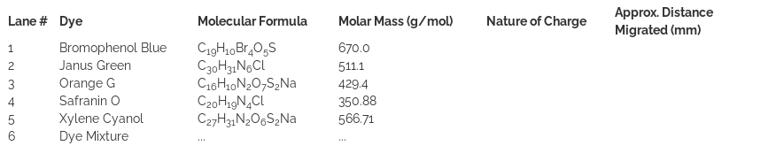

Suppose a particle with charge, +Q, is moving toward the negative electrode (cathode) in a nonconducting medium under an electric field, E. Two opposing forces act on the particle: the force exerted by the field, FE = QE, in the direction of the motion toward the cathode, and the frictional force, Ffr, retarding its motion toward the cathode. Under this condition, if the particle with charge, +Q, moves at a constant velocity (the acceleration, a, of the particle is 0) toward the cathode, the net force Fnet on the particle is zero (since F = ma). But  

Fnet = Fe + Ffr = 0	

The frictional force is given by, Ffr = -fv , where f is a constant called the frictional coefficient and v is the velocity of the particle. The frictional coefficient, f, depends on the size and shape of the molecule. For a spherical particle the frictional coefficient is given by f = 6 &#163; S&#163;bRs, where &#163;b is¡P is the coefficient of viscosity and Rs (Stokes radius) is the radius of the hydrated sphere.

From the above equations, one obtains fv = QE, or U (electrophoretic mobility) = v/E = Q/f = Q/6&#163;S&#163;bRs,  

The above equation shows that the electrophoretic mobility, U, is directly proportional to the charge (Q) and inversely proportional to the particle size (Rs) and the coefficient of viscosity (?) of the medium. Q/Rs is also known as the charge density of the particle. Thus the electrophoretic mobility in a given medium varies depending on the charge density of the particles. The direction of particle movement under an applied field depends on the nature of electric charge on the particle (positively charged particles to the cathode and the negatively charged ones to the anode). Since under an electric field the directions and rates of motion of particles in a medium vary depending on their charges and charge densities, application of the electric field for a given period of time could result in completely different displacements for different particles. This forms the basis of separation of charged particles via electrophoresis.

In gel electrophoresis, the particles to be separated are placed in wells of a gel medium and an electric field is applied to the medium which results in separated bands of particles. It should be noted that the above equations deal with spherical particles. In addition to the size and charge, the rate of particle movement depends on its shape and the density of the gel through which it moves. Gels which have porous network structures allow movement of solvent and solute particles through the pores. This helps to eliminate thermal convection forces in the liquid medium which would interfere with the separation process. The pore size and the network structure of the gel provide an additional sieving mechanism by retarding the motion of particles/molecules that increases the resolving power of this separation technique. Further, gels can maintain the finished separation over a long period of time that is necessary for many post electrophoresis operations.

A gel electrophoresis system has following basic components: a D. C. power supply unit, an electrophoresis chamber, gel casting trays, glass slides, and well forming templates called combs. The casting tray is used for casting gels. The gel forming material is poured in the tray as a hot liquid which forms semi-solid gel on cooling. In order to slide the finished gel out of the casting tray, the glass plate is placed at the bottom of the tray. The comb is used to create wells in the gel. It is placed in slots provided on the side or middle of the casting tray before the hot gel forming material is poured into the tray. The teeth of the comb leave small grooves or wells in the gel medium when it is taken out carefully after the gel solidifies. The wells are places where samples of particles to be separated are added.

Agar gel electrophoresis is one of the most commonly used methods of the various types of electrophoresis. Agar gel electrophoresis is widely used in separating fragments of DNA. The gel is made by first melting agar powder in boiling buffer solution and then cooling in a casting mould. The solidified gel medium is submerged in a buffer-filled electrophoresis chamber. The buffer not only controls the required pH of the medium but also serves as a conductor of electricity. Prior to connecting the electrophoresis apparatus to a direct current (D.C.) power source for applying a required voltage, the samples are delivered into the sample wells with appropriate transfer pipettes. Charged particles enter the gel through the walls of the wells and separate into one or more distinct bands, one band per component, during the migration.

In order to identify the locations and the size of bio-macromolecules, staining of biomolecules is required. Various dyes are used for this purpose. Bromophenol Blue, Janus Green, Orange G, Safranin O and Xylene Cyanol are examples of dyes that are often used in gel electrophoresis. In addition to different colours, some of these dyes (such as Bromophenol Blue, Xylene cyanol, and Orange G) acquire negative charges and migrate with speeds almost similar to various sized DNA fragments. Therefore, these dyes have been used as fairly accurate size indicators for small DNA fragments. Here we shall run gel electrophoresis of these five dyes and a two-component dye mixture. This allows the progress of the electrophoresis run and the migration of the coloured dyes in the gel to be visualized directly due to their distinct colours. It is to be noted that one should view the results of dye electrophoresis immediately after the completion of the run, because the dye molecules due to their relatively small sizes rapidly diffuse out of the gel. 

